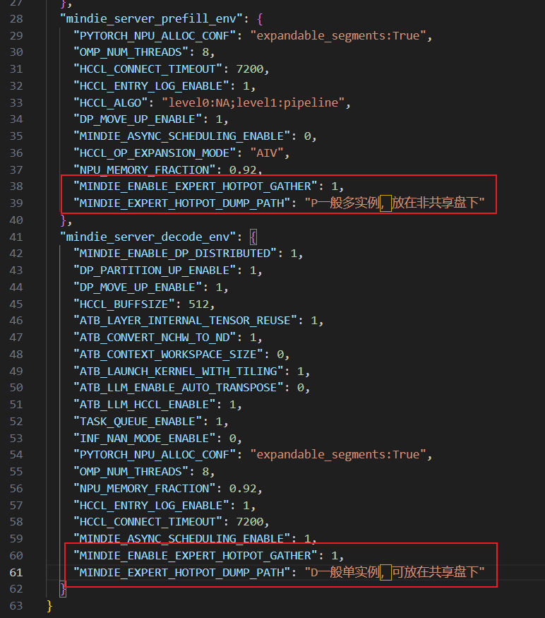

# 负载均衡

## 简介

在MOE（Mixture-of-Experts ）架构中，不同专家所接收的输入tokens数量存在显著差异，这直接导致了AlltoAll通信和专家计算负载的不均衡。热门专家所在的NPU卡会面临算力和通信资源紧张，而冷门专家所在的NPU卡则会出现算力和通信资源的浪费，从而导致性能的损失。负载均衡特性旨在降低NPU卡间的不均衡度，从而提升模型推理的性能。

MindIE当前支持两种负载均衡特性：静态冗余负载均衡和强制负载均衡。

- 静态冗余负载均衡：采用部署额外的冗余专家方式，减少热点专家的负载，将热点专家的负载分散到冗余专家上，以达到负载均衡的效果。

- 强制负载均衡：采用让专家负载绝对均衡的“假”tensor替换原始topk的输出，对专家topk算子的输出进行mock。强制负载均衡只是为负载均衡提供了理论上限，改变了模型专家实际路由，不能在正式业务中使用。

## 限制与约束

- Atlas 800I A2/A3 推理服务器支持此特性。
- DeepSeek R1/V3、Qwen-moe模型支持此特性。
- 当前只支持在MOE为All2All集合通信场景下使用（模型配置文件中的“ep\_level”参数为“2”）。PD分离场景，由于Prefill和Decode通常采用不同的集合通信方式，负载均衡的配置参数需分别设置。
- 强制负载均衡只能作为负载均衡的理论上限，不能在正式业务中使用。
- 静态冗余负载均衡采用在路由专家的NPU卡额外部署冗余专家方案，每卡多部署一个冗余专家，需额外占用2.4GB显存。

## 使用流程

静态冗余负载均衡使用流程为：专家热点信息采集、冗余专家部署表生成和负载均衡参数配置。


- 强制负载均衡无需进行专家热点信息采集和冗余专家部署表生成，直接进行负载均衡参数配置即可开启。

### 专家热点信息采集

专家热点信息采集，为获取用户实际业务数据或数据集下的专家的热点分布。

1. 用户需在不开启负载均衡时，通过设置“MINDIE\_ENABLE\_EXPERT\_HOTPOT\_GATHER”和“MINDIE\_EXPERT\_HOTPOT\_DUMP\_PATH”两个环境变量，导出实际业务场景下专家热点信息的.csv文件。Prefill和Decode热点信息会分别保存，以便分别生成Prefill和Decode的冗余专家部署表。

    设置方法如下：

    分别在“examples/kubernetes\_deploy\_scripts/conf/mindie\_env(_a3).json”文件的“mindie\_server\_prefill\_env”和“mindie\_server\_decode\_env”字段中，增加环境变量如下:

    - "MINDIE\_ENABLE\_EXPERT\_HOTPOT\_GATHER": 1,
    - "MINDIE\_EXPERT\_HOTPOT\_DUMP\_PATH": "单个实例可选择共享盘路径，否则必须存储在非共享盘"

        

2. 执行模型推理业务，生成热点信息文件。

    > [!NOTE]说明  
    > 如果是服务化采集，数据集跑完后请及时关闭服务化。

3. 热点信息生成后，需手动将所有机器上的专家热点信息汇总至同一个文件夹，也可直接将所有机器上的导出文件路径设置为共享磁盘路径。

### 冗余专家部署表生成

采集热点信息后，每个NPU会生成一个.csv文件，文件中包含一个矩阵（num\_moe\_layer \* 单NPU专家数）。矩阵中的每个数字代表该layer中该专家所计算的token数，每8个token会在采集文件中追加该矩阵。

根据采集的专家热点信息，可使用[msit工具](https://gitcode.com/Ascend/msit/blob/master/msit/docs/install/README.md)的“elb”组件生成冗余专家部署表。

1. 安装“elb”组件，安装方法如下所示。

    ```
    # 1.git clone
    git clone https://gitcode.com/Ascend/msit.git
    cd msit/msit
    
    # 2.安装msit
    pip install .
     
    # 3.通过msit install命令，安装所需组件elb组件
    msit install elb
     
    # 4.安装之后可以使用msit check elb命令检查安装是否成功
    msit check elb
    ```

2. 显示如下回显信息，表示安装成功。

    ```text
    2025-07-16 15:08:58,383 - 36266 - msit_llm_logger - INFO - msit-surgeon
    2025-07-16 15:08:58,395 - 36266 - msit_llm_logger - INFO -   not install yet.
    2025-07-16 15:08:58,395 - 36266 - msit_llm_logger - INFO - msit-analyze
    2025-07-16 15:08:58,407 - 36266 - msit_llm_logger - INFO -   not install yet.
    2025-07-16 15:08:58,407 - 36266 - msit_llm_logger - INFO - msit-convert
    2025-07-16 15:08:58,419 - 36266 - msit_llm_logger - INFO -   not install yet.
    2025-07-16 15:08:58,419 - 36266 - msit_llm_logger - INFO - msit-profile
    2025-07-16 15:08:58,431 - 36266 - msit_llm_logger - INFO -   not install yet.
    2025-07-16 15:08:58,431 - 36266 - msit_llm_logger - INFO - msit-tensor-view
    2025-07-16 15:08:58,443 - 36266 - msit_llm_logger - INFO -   not install yet.
    2025-07-16 15:08:58,443 - 36266 - msit_llm_logger - INFO - msit-benchmark
    2025-07-16 15:08:58,454 - 36266 - msit_llm_logger - INFO -   not install yet.
    2025-07-16 15:08:58,454 - 36266 - msit_llm_logger - INFO - msit-compare
    2025-07-16 15:08:58,465 - 36266 - msit_llm_logger - INFO -   not install yet.
    2025-07-16 15:08:58,465 - 36266 - msit_llm_logger - INFO - msit-opcheck
    2025-07-16 15:08:58,476 - 36266 - msit_llm_logger - INFO -   not install yet.
    2025-07-16 15:08:58,476 - 36266 - msit_llm_logger - INFO - msit-graph
    2025-07-16 15:08:58,488 - 36266 - msit_llm_logger - INFO -   not install yet.
    2025-07-16 15:08:58,488 - 36266 - msit_llm_logger - INFO - msit-elb
    2025-07-16 15:08:58,632 - 36266 - msit_llm_logger - INFO -   OK
    ```

3. 参见[负载均衡亲和专家寻优指南](https://gitcode.com/Ascend/msit/blob/master/msit/docs/expert_load_balancing/%E5%B7%A5%E5%85%B7-%E8%B4%9F%E8%BD%BD%E5%9D%87%E8%A1%A1%E4%BA%B2%E5%92%8C%E4%B8%93%E5%AE%B6%E5%AF%BB%E4%BC%98.md)，使用“elb”组件生成冗余专家部署表。8机64卡典型配置如下：

    ```
    msit elb -icp input_dir_path -o output_file_path -nre 0 -nd 8 -nn 64 -al 5 -dt a2
    ```

    msit工具提供两种负载均衡算法：计算通信负载均衡算法（C2LB）和speculative-moe interface algorithm。当前speculative-moe level 2 混置算法（al 5）取得最优.

    > [!NOTE]说明 
    >- PD分离场景，可分别单独生成Prefill和Decode的冗余专家部署表。
    >- PD混合场景，只需生成Decode的冗余专家部署表，以提升Decode性能。

### 负载均衡参数配置

负载均衡参数，可通过修改atb-models安装目录下的“\{ATB安装路径\}/atb-models/atb\_llm/conf/config.json”进行配置。修改“models/deepseekv2/eplb”字段里的“level”、“expert\_map\_file”、“rep\_per\_rank”、"aggregate\_threshold"、"buffer\_expert\_layer\_num"、"num\_expert\_update\_ready\_countdown"参数，默认配置为不开启负载均衡。典型配置如下：

```json
{
    "models": {
        "deepseekv2": {
            "eplb": {
                "level": 1,
                "expert_map_file": "xxxx.json"
            }
        }
    }
}
```

参数说明如下：

|配置项|取值类型|取值范围|配置说明|
|--|--|--|--|
|level|int|[0, 3]|0 : 不开启负载均衡<br>1 : 开启静态冗余负载均衡<br>2 : 开启动态冗余负载均衡（暂不支持<br>3 : 开启强制负载均衡<br>默认值：0|
|expert_map_file|string|该文件路径存在|静态冗余负载专家部署表路径。<br>默认值：""|


