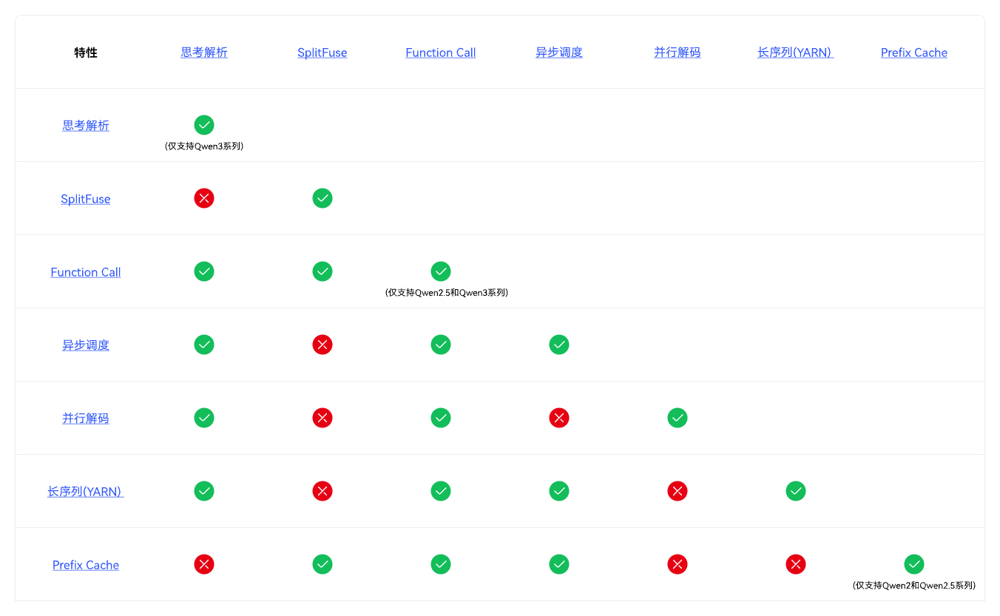

# 特性叠加

本章节提供DeepSeek模型和Qwen模型的特性叠加说明。

## DeepSeek模型

DeepSeek模型支持的特性叠加情况如下所示。

对于DeepSeek模型，最大支持CPSP+prefix cache \(MoonCake 池化\)+MTP+异步调度+KV Cache int8叠加，并支持5种特性自由组合。短序列（上下文长度短于16k）通常无需开启CPSP，长序列（上下文长度长于128k）不能叠加MTP特性。

## Qwen模型

Qwen模型支持的特性叠加情况如下所示。

