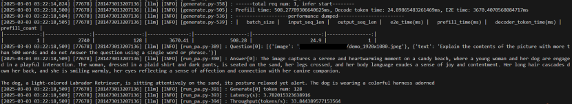
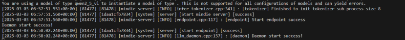
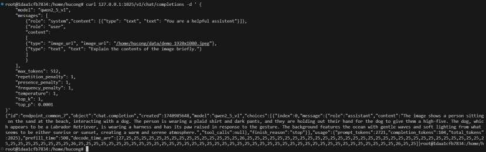

## 简介

多模态理解模型是基于大语言模型的深度学习类模型，能够处理并理解多种不同的数据类型。当前多模态理解模型主要是针对文本、图片、视频、音频等数据类型进行处理，并提取整合其特征，最终由大语言基座模型进行理解并产生对应的内容。

-  主要特点和优势：拥有更完善的跨模态信息抽取能力和更准确的多模态数据理解能力。
-  应用场景：图像问答、情感分析、自然语言对话、视频分析、自动驾驶等领域。

其数据量多且大的特点，使得数据表征对齐和更高的计算资源要求等成为新的挑战。总的来说，多模态模型将文本、图像、音频或视频等至少两种模态的数据作为输入，从输入的多模态数据中提取特征并进行融合，从而使得多模态模型能够实现更全面、更准确的理解和推理能力。

目前仅支持输入为多模态数据，输出为文字数据的多模态理解模型。多模态生成类模型请参考《MindIE SD开发指南》。

多模态理解类模型执行推理的方式与大语言模型略有不同，在执行推理时您可参考模型仓中对应模型的README进行推理。模型的README路径为：

“$\{llm\_path\}/examples/models/\{model\}/README.md“

## 限制与约束

- Atlas 800I A2 推理服务器和Atlas 300I Duo 推理卡支持此特性。
- 模型特性矩阵及相关文档请参考[模型支持列表](https://www.hiascend.com/software/mindie/modellist)中的“多模态理解模型列表”。

## 使用样例

### 纯模型使用

以InternVL2.5模型为例，执行纯模型推理步骤如下：

1. 进入容器。

    ```
    docker exec -it {docker_name} bash
    ```

2. 安装相关配套以后，设置环境变量，以下为MindIE镜像场景时的默认安装路径。

    ```
    # 配置CANN环境，默认安装在/usr/local目录下
    source /usr/local/Ascend/ascend-toolkit/set_env.sh
    # 配置加速库环境
    source /usr/local/Ascend/nnal/atb/set_env.sh
    # 配置MindIE环境变量
    source /usr/local/Ascend/mindie/latest/mindie-service/set_env.sh
    # 配置模型仓环境变量
    source /usr/local/Ascend/atb-models/set_env.sh
    ```

3. 安装模型的第三方依赖，注意根据模型名称选择正确的requirements文件进行安装，确保第三方依赖安装正确。此处同样以InternVL2.5为例：

    ```
    pip install -r ${llm_path}/requirements/models/requirements_internvl.txt
    ```

4. 执行启动脚本，进行推理。

    对话测试：

    ```
    bash ${llm_path}/examples/models/internvl/run_pa.sh --run (--trust_remote_code) ${weight_path} ${image_path} 
    ```

    性能测试：

    ```
    bash ${llm_path}/examples/models/internvl/run_pa.sh --performance (--trust_remote_code) ${weight_path} ${image_path} 
    ```

    **表 1**  可传入参数说明

|变量名|含义|
|--|--|
|llm_path|模型仓所在路径。若使用MindIE镜像，默认路径为： /usr/local/Ascend/atb-models/|
|trust_remote_code|是否信任本地的可执行文件，默认不执行。传入此参数，则信任。|
|weight_path|模型权重路径。|
|image_path|图片所在路径。|


5. 纯模型启动推理成功，如下图所示：

    


### 服务化使用

**限制与约束**

当用户使用多模态理解模型在服务化推理且输入输出序列为长序列时，可能会由于超出NPU内存限制而推理失败，导致服务化出现core dump问题。若遇到这种情况，需要先手动结束服务化进程，再重新拉起服务化。

为了避免多模态模型推理失败，需要对服务化参数和并发数进行限制。以Atlas 800I A2 推理服务器（64G）8卡，输入tokens=16384，输出tokens=2048场景为例，需要使用以下服务化参数进行配置。当用户使用的序列更长时，可以适当下调并发数。

|模型名称|maxPrefillTokens|npuMemSize|最大并发数|
|--|--|--|--|
|Qwen2-VL-72B|16384|30|40|
|Qwen2.5-VL-72B|16384|30|40|
|InternVL2.5-78B|16384|20|35|


**操作步骤**

以Qwen2-VL模型为例，执行服务化推理步骤如下：

1. 进入容器。

    ```
    docker exec -it {docker_name} bash
    ```

2. 安装相关配套以后，设置环境变量，以下为使用MindIE镜像场景时的默认安装路径。

    ```
    # 配置CANN环境，默认安装在/usr/local目录下
    source /usr/local/Ascend/ascend-toolkit/set_env.sh
    # 配置加速库环境
    source /usr/local/Ascend/nnal/atb/set_env.sh
    # 配置MindIE环境变量
    source /usr/local/Ascend/mindie/latest/mindie-service/set_env.sh
    # 配置模型仓环境变量
    source /usr/local/Ascend/atb-models/set_env.sh
    ```

3. 安装模型的第三方依赖，注意根据模型名称选择正确的requirements文件进行安装，确保第三方依赖安装正确。

    ```
    pip install -r /usr/local/Ascend/atb-models/requirements/models/requirements_{model}.txt
    ```

4. 下载基础模型权重后，配置服务化参数config.json文件。

    ```
    cd {MindIE安装目录}/latest/mindie-service/
    vi conf/config.json
    ```

    请重点关注并根据实际情况，修改配置文件中的参数（加粗），参数说明请参见[配置参数说明（服务化）](../user_manual/service_parameter_configuration.md)。

    “httpsEnabled”表示是否开启HTTPS协议。设为“True”表示开启HTTPS协议，此时需要配置双向认证证书；设为“False”表示不开启HTTPS协议。推荐开启HTTPS协议，并参见《MindIE Motor开发指南》中的“配套工具 \> MindIE Service Tools \> CertTools”章节，配置开启HTTPS通信所需服务证书、私钥等证书文件。

    配置文件config.json示例如下：

    ```
    {
        ...
        "ServerConfig" :
        {
            ...
            "port" : 1040,
            "managementPort" : 1041,
            ...
            "httpsEnabled" : true,
            ...
        },
     
    "BackendConfig": {
        ...
        "npuDeviceIds" : [[3]],
        ...
        "ModelDeployConfig":
        {
            ...
            "ModelConfig" : [
                {
                    "modelInstanceType": "Standard",
                    "modelName" : "qwen2-vl",
                    "modelWeightPath": "/data/datasets/qwen-2vl/",
                    "worldSize" : 1,
                    ...
                    "npuMemSize" : 8,
                    ...
                    "trustRemoteCode": true,
                }
            ]
        },
        ...
        }
    }
    ```

5. 拉起服务进程。

    ```
    ./bin/mindieservice_daemon
    ```

6. 发起请求，其他请求样例可参考《MindIE Motor开发指南》中的“服务化接口\> EndPoint业务面RESTful接口”章节，注意在请求侧不要配置网络代理。

    请求样例如下：

    ```
    POST https://{ip_address}:{port}/v1/chat/completions 
    {
        "model": "{model_name}",
        "messages": [
            {"role": "system", "content":[{"type": "text", "text": "You are a helpful assistant"}]},
            {"role": "user",
             "content": [{"type": "image_url", "image_url": "demo.png"},
                 {"type": "text", "text": "Generate the caption in English:"}]}],
        "max_tokens": 512,
        "presence_penalty": 1,
        "frequency_penalty": 1,
        "temperature": 1,
        "top_p": 1,
        "top_k": 0.0001
    }
    ```

    > [!NOTE]说明
    > “model”和“image\_url”参数的取值请根据实际情况进行修改。

7. 服务化拉起成功，如下图所示：

    

8.  服务化启动推理成功，如下图所示：

    

