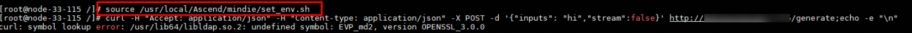

# 安装MindIE后，使用curl命令报错

## 问题描述

使用以下命令执行MindIE环境变量文件后报错：symbol lookup error: /usr/lib64/libldap.so.2: undefined symbol: EVP\_md2，如下图所示。

```bash
source /usr/local/Ascend/mindie/set_env.sh
```



## 原因分析

函数EVP\_md2是个不安全函数，MindIE编译时依赖Openssl，默认没有开启lagecy编译选项，所以不提供EVP\_md2函数。source MindIE环境变量后，MindIE安装包提供的libcrypto.so优先级更高，curl命令依赖EVP\_md2函数，由于找不到EVP\_md2函数，所以执行报错。

## 解决步骤

- 方式一：

    重新打开一个终端执行curl命令。如果终端自动执行source MindIE的环境变量文件set\_env.sh，则可以尝试使用unset LD\_LIBRARY\_PATH命令，避免优先查找安装包中的libcrypt.so。

- 方式二：

    在其他主机或curl功能正常的容器执行curl命令。

- 方式三：

    使用LD\_PRELOAD，指定系统中原有的crypto.so.3，示例如下所示：

    ```bash
    LD_PRELOAD=/usr/lib64/libssl.so.3:/usr/lib64/libcrypto.so.3 curl http://<ip>:<port>/<your_path>
    ```
