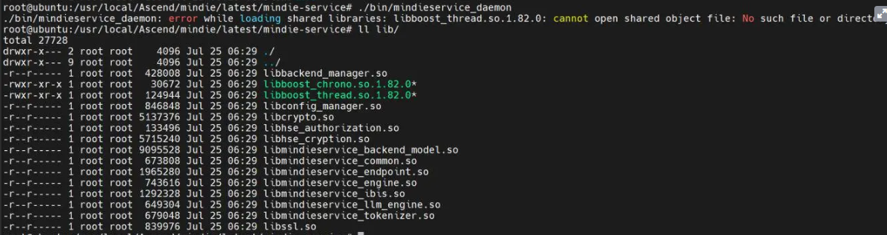
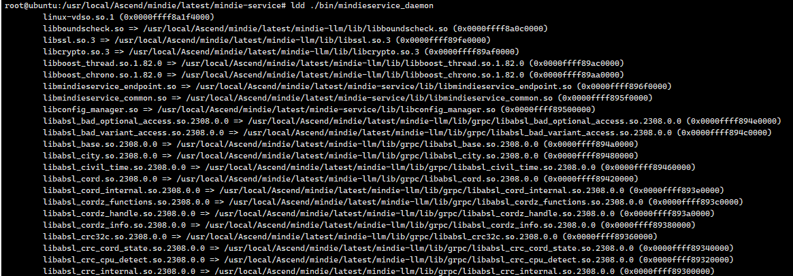
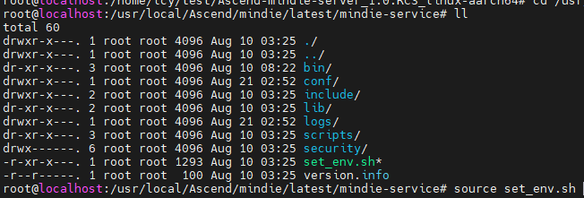

# 启动MindIE Motor服务时，出现找不到libboost\_thread.so.1.82.0报错

## 问题描述

启动MindIE Motor服务的时候，出现找不到libboost\_thread.so.1.82.0的报错，如下图所示。



## 原因分析

由于mindieservice\_daemon没有正确链接到动态依赖的so，导致服务启动失败。

## 解决步骤

1. 查询mindieservice\_daemon具体的so。

    此处以_\{MindIE安装目录\}_/latest/mindie-service为例。

    ```bash
    ldd ./bin/mindieservice_daemon
    ```

    

2. 执行**source set\_env.sh**命令，使mindieservice\_daemon正确链接到动态依赖的so。

    ```bash
    source set_env.sh
    ```

    
