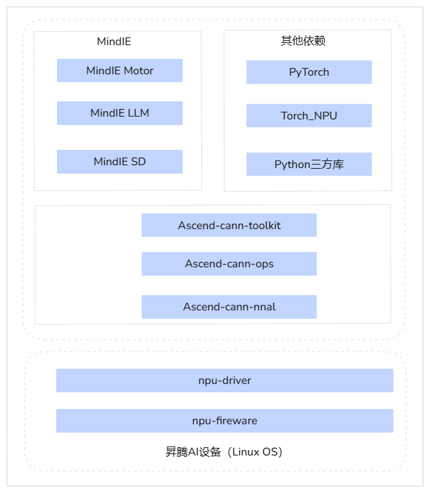

# 安装说明

介绍如何快速完成MindIE LLM软件的安装。

## 安装方案

本文档包含镜像、离线和源码场景下，安装MindIE软件的方案，部署架构如[图1](#figure1)所示。

各安装方案的使用场景以及优缺点如下所示，请根据自己的使用场景选择合适的安装方式。

- 镜像安装：该方式是最简单的一种安装方式，用户直接从昇腾社区下载已经打包好的镜像，镜像中已经包含了CANN、PyTorch、MindIE等必要的依赖与软件，用户只需拉取镜像并启动容器即可。镜像安装支持run包。
- 离线安装：该方式可将CANN、PyTorch、MindIE等软件与依赖安装到物理机或容器上。离线安装支持run包和whl包。
- 源码安装：如需体验最新功能，或对源码进行修改增强，可下载本仓库代码，自行编译并完成安装。源码安装支持whl包方式。

 > [!NOTE]说明
 >
 > - 新用户推荐whl包方式安装。
 > - 老用户升级场景，推荐使用run包方式安装。

**图 1**  部署架构  <a id="figure1"></a>



## 硬件配套和支持的操作系统

本章节提供软件包支持的操作系统清单，请执行以下命令查询当前操作系统的版本信息，如果查询的操作系统版本不在对应产品列表中，请替换为支持的操作系统。

```bash
uname -m && cat /etc/*release
```

**表 1**  操作系统支持列表

|硬件|操作系统|
|--|--|
|Atlas 800I A2 推理服务器|AArch64：<li>CentOS 7.6</li><li>CTYunOS 23.01</li><li>CULinux 3.0</li><li>Kylin V10 GFB</li><li>Kylin V10 SP2</li><li>Kylin V10 SP3</li><li>Kylin V10 SP3 2403 4.19.90-89.11.v2401</li><li>Kylin V11</li><li>Ubuntu 22.04</li><li>AliOS3</li><li>BCLinux 21.10 U4</li><li>Ubuntu 24.04 LTS</li><li>openEuler 22.03 LTS</li><li>openEuler 24.03 LTS SP1</li><li>openEuler 22.03 LTS SP4</li><li>Alibaba Cloud Linux 3.2104 U10</li><li>AntOS 6.6</li><li>UOS V25（内核6.6）</li>|
|Atlas 300I Duo 推理卡+Atlas 800 推理服务器（型号 3000）|AArch64：<li>BCLinux 21.10</li><li>Debian 10.8</li><li>Kylin V10 SP1</li><li>Kylin V10 SP3 2403 4.19.90-89.11.v2401</li><li>Kylin V11</li><li>Ubuntu 20.04</li><li>Ubuntu 22.04</li><li>UOS20-1020e</li><li>openEuler 24.03 SP1</li><li>openEuler 22.03 LTS SP4</li>|
|Atlas 300I Duo 推理卡+Atlas 800 推理服务器（型号 3010）|X86_64：<li>Ubuntu 22.04</li>|
|Atlas 800I A3 超节点服务器|AArch64：<li>openEuler 22.03</li><li>CULinux 3.0</li><li>Kylin V10 SP3 2403</li><li>Kylin V11</li><li>BCLinux 21.10 U4（内核版本：5.10.0-200.0.0.131.30）</li><li>CTyunOS 3</li><li>UOS V25（内核6.6）</li>|
|Atlas 200I Pro 加速模块|AArch64：<li>Ubuntu 22.04</li><li>openEuler 22.03 LTS</li>|
