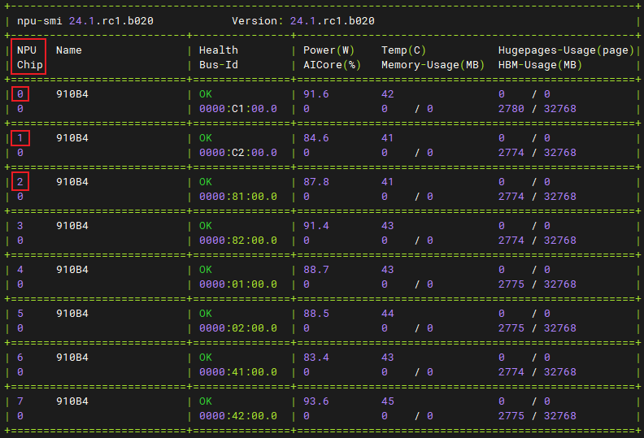
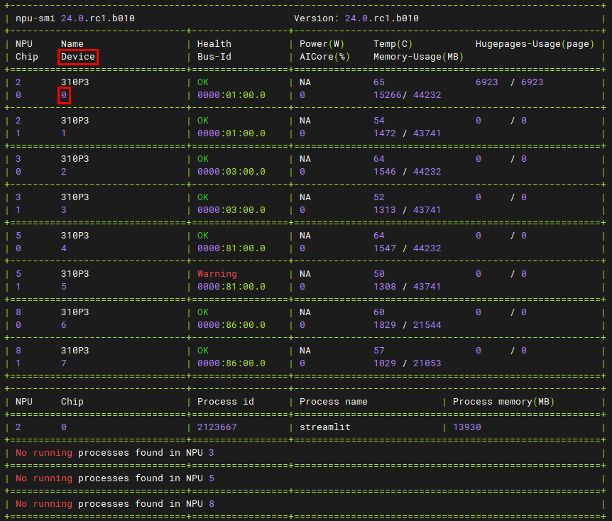

# README

此README公共脚本及其使用方式进行介绍

## 路径变量解释
| 变量名  | 含义                                             |
|--------|--------------------------------------------------|
| working_dir | 加速库及模型库下载后放置目录                  |
| llm_path | 模型仓所在路径。若使用编译好的包，则路径为`${working_dir}/llm_model/`；若使用gitcode下载的代码，则路径为`${working_dir}/MindIE-LLM/examples/atb_models`    |
| weight_path | 模型权重路径                                 |
| w8a8s_weight_path | 稀疏量化权重路径                        |
| w8a8sc_weight_path | 切分并压缩后的稀疏量化权重路径           |
| cur_dir | 运行指令或执行脚本时的路径（当前目录）              |

## 权重
### 权重设置
- `${weight_path}/config.json`文件中需设置`torch_dtype`、`kv_quant`、`quantize`和`quantization_config`类型来标识权重的量化类型和浮点精度
  - 若`torch_dtype`、`kv_quant`、`quantize`和`quantization_config`字段不存在，需新增

- 浮点精度配置
  | 浮点精度        | torch_dtype |
  |----------------|-------------|
  | FP16           | "float16"   |
  | BF16           | "bfloat16"  |
  - 此字段必须配置

- 线性层量化类型配置
  | 线性层量化类型  | quantize |
  |----------------|----------|
  | W8A8           | "w8a8"   |
  | W8A8S          | "w8a8s"  |
  | W8A8SC         | "w8a8sc" |
  | W8A16          | "w8a16"  | 
  - 若模型涉及线性层量化，则需配置此字段

- quantization_config为json结构体，其中包含了其余量化信息
  - "kv_quant_type"字段中包含KV Cache量化类型配置
    | KV Cache量化类型 | kv_quant_type |
    |-----------------|----------|
    | 进行KV Cache量化 | "C8"   |
    - 若模型涉及KV Cache量化，则需配置此字段
  - "group_size"字段配置per group量化中的group大小
    - 默认group_size为64
    - 使用per channel量化方式时，group_size需设置为0
    - group_size字段仅在W4A16和W8A16量化时生效

- 示例
  - LLaMa模型的权重使用BF16精度，非量化
    ```json
    {
      "architectures": [
        "LlamaForCausalLM"
      ],
      ...
      "torch_dtype": "bfloat16",
      ...
    }
    ```
  - LLaMa模型的权重使用FP16精度，W8A16量化
    ```json
    {
      "architectures": [
        "LlamaForCausalLM"
      ],
      ...
      "torch_dtype": "float16",
      ...
      "quantize": "w8a16",
    }
    ```

### 权重转换
> **说明：**
> 当前仅支持加载safetensor格式的权重文件
> - 若当前环境不存在模型权重，请至hugging face官网下载，模型下载链接见各模型README文件
> - 若下载的权重文件中已有safetensor格式的文件，则无需进行权重转换
> - 若环境中仅有bin格式的权重文件，请按照如下方式进行转换
- 脚本：`${llm_path}/examples/convert/convert_weights.py`
- 功能：基于bin格式权重，生成safetensor格式权重，输出结果保存在bin权重同目录下
- 参数说明
  | 参数名称    | 是否为必选 | 类型    | 默认值 | 描述         |
  |------------|-----------|---------|-------|--------------|
  | model_path | 是        | string  |        | 模型权重路径 |
- 示例
    ```shell
    cd ${llm_path}
    python examples/convert/convert_weights.py --model_path ${weight_path}
    ```
  - 注意：必须先进入`${llm_path}`路径下执行以上命令，否则由于脚本中存在相对路径，会导致module not found的问题

#### 训练权重转换
> 若需要将Megatron训练后权重转换为safetensors格式
- 请移步ModelLink仓库的[权重转换](https://gitee.com/ascend/ModelLink/blob/master/examples/README.md)第2.2章节，按照ModelLink开发指南先将训练后权重格式转换为bin格式的权重文件，再进行上一步safetensors权重转换

### 权重切分
> **说明：**
> 当前仅支持加载safetensor格式的权重文件
- 脚本：`${llm_path}/examples/convert/weight_sharder/weight_sharder.py`
- 功能：基于safetensor格式权重，根据并行策略切分权重并完成分片存储，输出结果保存在指定目录下
- 参数说明
  | 参数名称        | 是否为必选 | 类型    | 默认值 | 描述           |
  |----------------|-----------|---------|--------|---------------|
  | model_path     | 是        | string  |        | 原始模型权重路径|
  | dp             | 否        | string  |        | 数据并行度     |
  | tp             | 否        | string  |        | 张量并行度     |
  | sp             | 否        | string  |        | 序列并行度     |
  | cp             | 否        | string  |        | 上下文并行度   |
  | moe_tp         | 否        | string  |        | moe张量并行度  |  
  | moe_ep         | 否        | string  |        | moe专家并行度  |
  | save_directory | 是        | string  |        | 切分权重保存路径  |  

- 示例
在双机场景下，按照dp=2，tp=8，moe_tp=4，moe_ep=4的并行策略切分权重
    ```shell
    torchrun --nnodes=2 --nproc_per_node 8 --node_rank=0 --master_addr={master ip} --master_port {master_port} -m examples.convert.weight_sharder.weight_sharder --model_path ${weight_path} --dp 2 --tp 8 --moe_tp 4 --moe_ep 4 --save_directory ${save_path}
    torchrun --nnodes=2 --nproc_per_node 8 --node_rank=1 --master_addr={master ip} --master_port {master_port} -m examples.convert.weight_sharder.weight_sharder --model_path ${weight_path} --dp 2 --tp 8 --moe_tp 4 --moe_ep 4 --save_directory ${save_path}
    ```

### 权重量化
权重量化依赖msModelSlim工具，下载及安装方式见[README](https://gitcode.com/ascend/msit/blob/master/msmodelslim/README.md)
#### 量化脚本
- 脚本：`${llm_path}/examples/convert/model_slim/quantifier.py`
- 功能：基于浮点权重进行量化，生成量化权重
- 参数说明
  | 参数名称              | 是否为必选 | 类型                  | 默认值            | <div style="width:1000px">描述</div> |
  |----------------------|-----------|-----------------------|------------------|--------------------------------------|
  | model_path           | 是        | string                |                  | 模型权重路径 |
  | save_directory       | 是        | string                |                  | 量化权重保存路径 |
  | part_file_size       | 否        | string                | None             | 量化权重保存文件切分大小，单位GB，默认不切分 |
  | calib_texts          | 否        | string                | None             | 量化时的校准数据，多条数据以空格分隔 |
  | calib_file           | 否        | string                | ${llm_path}/examples/convert/model_slim/teacher_qualification.jsonl | 包含校准数据的文件 |
  | w_bit                | 否        | int                   | 8                | 权重量化bit |
  | a_bit                | 否        | int                   | 8                | 激活值量化bit |
  | disable_names        | 否        | string                | None             | 需排除量化的节点名称，即手动回退的量化层名称，多条数据以空格分隔。若精度太差，推荐回退量化敏感层，如分类层、输入层、检测head层等 |
  | device_type          | 否        | string                | "cpu"            | 量化时的硬件类型，仅支持"cpu"或"npu" |
  | fraction             | 否        | float                 | 0.01             | 稀疏量化精度控制 |
  | act_method           | 否        | int                   | 1                | 激活值量化方法，仅支持1或2或3；1代表Label-Free场景的min-max量化方式，2代表Label-Free场景的histogram量化方式，3代表Label-Free场景的自动混合量化方式；开启lowbit稀疏量化功能时不支持选择值3 |
  | co_sparse            | 否        | bool                  | False            | 是否开启稀疏量化功能。 大模型稀疏量化场景下，优先使用lowbit稀疏量化功能，开启lowbit稀疏量化后，co_sparse参数自动失效 |
  | anti_method          | 否        | string                | ""               | 离群值抑制算法，默认不开启 |
  | disable_level        | 否        | string                | "L0"             | 自动回退等级，默认不执行回退 |
  | input_ids_name       | 否        | string                | "input_ids"      | tokenize后input_ids对应的键名 |
  | attention_mask_name  | 否        | string                | "attention_mask" | tokenize后attention_mask对应的键名 |
  | do_smooth            | 否        | bool                  | False            | 是否开启smooth功能。启用do_smooth功能后，平滑激活值。默认为False，不开启smooth功能 |
  | use_sigma            | 否        | bool                  | False            | 是否启动sigma功能。启用use_sigma功能后，可根据正态分布数值特点进行异常值保护。默认为False，不开启sigma功能 |
  | sigma_factor         | 否        | float                 | 3.0              | 启用sigma功能后sigma_factor的值，用于限制异常值的保护范围。默认为3，取值范围为[3, 4] |
  | is_lowbit            | 否        | bool                  | False            | 是否开启lowbit量化功能。 默认为False，不开启lowbit量化功能 |
  | mm_tensor            | 否        | string                | True             | 选择进行per-channel量化或per-tensor量化 <br> True: per-tensor量化 <br> False: per-channel量化 |
  | w_sym                | 否        | string                | True             | 权重量化是否为对称量化，默认开启对称量化 |
  | use_kvcache_quant    | 否        | bool                  | False            | 是否使用kvcache量化功能，默认不开启kvcache量化功能 |
  | use_reduce_quant     | 否        | bool                  | False            | 是否使用lccl reduce量化功能，默认不开启 |
  | tp_size              | 否        | int                   | 1                | lccl reduce量化时需要用到的卡数，默认为1 |
  | open_outlier         | 否        | bool                  | True             | 是否开启权重异常值划分，默认开启权重异常值划分 |
  | group_size           | 否        | int                   | 64               | per_group量化中group的大小。 默认值为64，支持配置为64或128 |
  | is_dynamic           | 否        | bool                  | False            | True：使用per-token动态量化。False：不使用per-token动态量化。|
  | tokenizer_args       | 否        | 符合json格式的string    | "{}"             | tokenize扩展参数 |
  | disable_last_linear  | 否        | bool                  | True             | 是否禁用最后一层全连接层量化，默认为True，即禁用 |
  | model_name           | 否        | string                | None             | 模型名称，默认为None |
  | trust_remote_code    | 否        | bool                  | store_true       | 为可选参数代表是否信任模型权重路径下的自定义代码文件：默认不执行。传入此参数，则信任本地自定义代码文件。 |
  | use_fa_quant         | 否        | bool                  | False             | 是否使用FA3量化。True: 使用FA3量化类型；False: 不使用FA3量化类型。 |
  | fa_amp               | 否        | int                   | 0       | FA3量化场景下的自动回退的layer数量。数据取值范围是大于等于0，并且小于等于模型layer数量，如果超出模型的layer数量将会取模型的最大layer数量为回退层数。 |
- 使用示例见模型Readme文件

#### NPU量化
- 环境要求
  - 硬件环境：Atlas 800I A2或Atlas 300I DUO环境
  - Pytorch、PTA配套在2.1版本及以上
  - CANN >= 8.0.RC2.B010
  - accelerate >= 0.28.0
  - 关闭虚拟内存：`PYTORCH_NPU_ALLOC_CONF`环境变量需设置为`expandable_segments:False`
  - 需要设置`ASCEND_RT_VISIBLE_DEVICES`环境变量，以控制量化运行时可使用的卡（例如：`export ASCEND_RT_VISIBLE_DEVICES=0,1`）。Atlas 300I DUO仅支持单卡单芯量化
  - 不支持多机量化
- 调用`${llm_path}/examples/convert/model_slim/quantifier.py`脚本时，`--device_type`参数需设置为`npu`
- 量化脚本具体参数配置和运行指令见各模型README文件

### 稀疏量化权重多卡切分及压缩脚本
- 脚本：`${llm_path}/examples/convert/model_slim/sparse_compressor.py`
- 功能：加载权重并进行多卡切分，在切分后的权重上执行压缩算法
- 运行前需要确保压缩工具编译过，{$msModelSlim安装路径}为msModelSlim所在的python-package路径，例如`/usr/local/pyython3.10.2/lib/python3.10/site-packages/msmodelslim`
  ```shell
  cd {$msModelSlim安装路径}/pytorch/weight_compression/compress_graph
  bash build.sh /usr/local/Ascend/ascend-toolkit/latest
  ```
- 调用方法
  ```shell
  torchrun --nproc_per_node {TP数} -m examples.convert.model_slim.sparse_compressor --model_path ${w8a8s_weight_path} --save_directory ${w8a8sc_weight_path}
  ```
  - TP数为张量并行个数，需和权重运行时的张量并行个数保持一致
- 参数说明
  | 参数名称              | 是否为必选 | 类型    | 默认值 | 描述                        |
  |----------------------|-----------|---------|-------|-----------------------------|
  | model_path           | 是        | string  |       | 模型权重路径                 |
  | save_directory       | 是        | string  |       | 切分并压缩后的量化权重保存路径 |
  | multiprocess_num     | 否        | int     | 8     | 压缩算法使用的线程数          |
  | save_split_w8a8s_dir | 否        | string  | None  | 切分但未经压缩的量化权重保存路径 |
  | trust_remote_code    | 否        | bool    | store_true       | 为可选参数代表是否信任模型权重路径下的自定义代码文件：默认不执行。传入此参数，则信任本地自定义代码文件。 |
- 压缩算法与硬件强相关，当前仅Atlas 300I DUO卡支持稀疏量化

## 部分环境变量介绍
  - `ASCEND_RT_VISIBLE_DEVICES`
    - 指定当前机器上可用的逻辑NPU核心，多个核心间使用逗号相连
    - 核心编号需要通过 npu-smi info 指令查阅
    - Atlas 800I A2服务器需基于输出的 NPU 列查阅
        
    - Atlas 300I DUO服务器需基于输出的 Device 列查阅
        
        - 若要使用单卡双芯，请指定至少两个可见核心；若要使用双卡四芯，请指定至少四个可见核心
  - `BIND_CPU`
    - 绑定CPU核心开关
    - 设置为1进行绑核，设置为0则不绑核；默认进行绑核
    - 若当前机器未设置NUMA或绑核失败，可将 BIND_CPU 设为 0
  - `PROFILING_LEVEL`
    - 设置ProfilerLevel，默认为"Level0"
  - `ATB_PROFILING_ENABLE`
    - 是否落性能profiling文件
    - 设置为1生成profiling文件，设置为0则不生成；默认不生成profiling文件
  - `PROFILING_FILEPATH`
    - （若生成profiling文件）profiling文件的路径
    - 默认为`${cur_dir}/profiling`
  - `ATB_LLM_BENCHMARK_ENABLE`
    - 是否统计端到端和各token的性能数据
    - 设置为1统计耗时，设置为0则不统计；默认不统计
    - 使能此功能时，`MODELTEST_DATASET_SPECIFIED`环境变量不能为空
  - `ATB_LLM_BENCHMARK_FILEPATH`
    - 性能数据的保存路径
    - 默认为`${cur_dir}/benchmark_result/benchmark.csv`
  - `ATB_LLM_LCOC_ENABLE`
    - 是否开启通信计算掩盖功能
    - 在Prefill阶段开启通信计算掩盖会提升性能
  - `ATB_LLM_LOGITS_SAVE_ENABLE`
    - 是否保存每个token的logits，每个logits会保存成一个单独的pth文件
    - 设置为1保存，设置为0则不保存；默认不保存
    - 使能此功能时，`MODELTEST_DATASET_SPECIFIED`环境变量不能为空
  - `ATB_LLM_LOGITS_SAVE_FOLDER`
    - logits保存路径
    - 默认为`${cur_dir}`
  - `ATB_LLM_TOKEN_IDS_SAVE_ENABLE`
    - 是否保存每个token的id，输入和输出token会单独保存成两个文件
    - 设置为1保存，设置为0则不保存；默认不保存
  - `ATB_LLM_TOKEN_IDS_SAVE_FOLDER`
    - token id保存路径
    - 默认为`${cur_dir}`
  - `ATB_LLM_RAZOR_ATTENTION_ENABLE`
    - 使用使用RAZOR ATTENTION（RA）
    - 设置为1开启，设置为0不开启；默认不开启`

## 启动脚本
### run_fa.py脚本参数介绍
- 脚本：`${llm_path}/examples/run_fa.py`
- 功能：Flash Attention场景下模型推理的启动脚本
- 参数说明
  | 参数名称                 | 是否为必选 | 类型                   | 默认值                     | <div style="width:1000px">描述</div> |
  |-------------------------|-----------|----------------------|----------------------------|--------------------------------------|
  | model_path              | 是        | string                |                            | 模型权重路径 |
  | input_text              | 否        | string                | ["What's deep learning?"] | 推理文本，多条数据间使用空格分割 |
  | max_input_length        | 否        | int                   | 512                        | 推理文本最大token数 |
  | max_output_length       | 否        | int                   | 20                         | 推理结果最大token数 |
  | max_position_embeddings | 否        | int或者None            | None                      | 模型可接受的最大上下文长度。当此值为None时，则从模型权重文件中读取 |
  | batch_size              | 否        | int                   | 1                          | 模型推理时使用的Batch size |
  | num_beams               | 否        | int                   | 1                          | beam search方法参数，用于决定num_beams个概率最大的token选择，并进行下一轮的toekn预测 |
  | temperature             | 否        | float                 | 1.0                        | 温度参数，该参数控制生成输出时每个token的概率分布的平滑程度 |
  | top_p                   | 否        | float                 | 0.0                        | 概率参数，用于控制生成输出时，只考虑累计概率分布在前top_p的token |
  | length_penalty          | 否        | float                 | 1.0                        | 长度惩罚参数 |
  | repetition_penalty      | 否        | float                 | 1.0                        | 重复惩罚参数 |
  | inputs_embeds_dir       | 否        | string                | None                       | 输入Embedding文件路径，文件为pt格式 |
  | min_length              | 否        | int                   | 10                         | 范围约束，控制最小长度 |
  | stop_words_ids          | 否        | 符合json格式的字符串    | None                        | 停词参数 |
  | do_sample               | 否        | bool                  | False                      | 是否开启随机采样 |
  | results_save_path       | 否        | string                | None                       | 推理结果保存路径，需同步传入inputs_embeds_dir参数，否则不生效 |
  | enable_atb_torch        | 否        | bool                  | store_true                 | 是否使用Python组图。默认使用C++组图，若传入此参数，则使用Python组图。|
  | trust_remote_code       | 否        | bool                  | store_true       | 为可选参数代表是否信任模型权重路径下的自定义代码文件：默认不执行。传入此参数，则信任本地自定义代码文件。 |
- 说明
  - `input_text`参数包含推理内容，程序进行数据处理的时间和传入数据量成正比。同时这些输入会被转换成token id搬运至NPU，传入数据量过大可能会导致这些NPU tensor占用显存过大，而出现由out of memory导致的报错信息。
  - 脚本会基于`max_input_length`、`max_output_length`、`num_beam`等参数申请推理输入及KV Cache，若用户传入数值过大，会出现由out of memory导致的报错信息，例如："RuntimeError: NPU out of memory. Tried to allocate xxx GiB."。
  - 脚本会基于`max_position_embeddings`参数，申请旋转位置编码和attention mask等NPU tensor，若用户传入数值过大，会出现由out of memory导致的报错信息，例如："RuntimeError: NPU out of memory. Tried to allocate xxx GiB."。
- 示例
  ```shell
  # 使用多卡运行Flash Attention，设置模型权重路径，设置输出长度为2048个token
  torchrun --nproc_per_node 2 --master_port 20038 -m examples.run_fa --model_path ${weight_path} --max_output_length 2048
  ```

### run_pa.py脚本参数介绍
- 脚本：`${llm_path}/examples/run_pa.py`
- 功能：Paged Attention场景下模型推理的启动脚本
- 参数说明
  | 参数名称                 | 是否为必选 | 类型                  | 默认值                     | <div style="width:1000px">描述</div> |
  |-------------------------|-----------|-----------------------|----------------------------|--------------------------------------|
  | model_path              | 是        | string                |                            | 模型权重路径 |
  | input_texts             | 否        | string                | ["What's deep learning?"]  | 推理文本或推理文本路径，多条推理文本间使用空格分割 |
  | input_ids               | 否        | string                | None                       | 推理文本经过模型分词器处理后得到的token id，多条推理请求间使用空格分割，单个推理请求内每个token使用逗号隔开 |
  | input_file              | 否        | jsonl格式文件          | None                       | 包含多轮对话文本的文件。<br> 仅支持jsonl格式文件，每一行必须为List[Dict]格式的按时间顺序排序的对话数据，每个Dict字典中需要至少包含"role"和"content"两个字段 |
  | input_dict              | 否        | string                | None                       | 推理文本以及对应的adapter名称。格式形如：'[{"prompt": "A robe takes 2 bolts of blue fiber and half that much white fiber.  How many bolts in total does it take?", "adapter": "adapter1"}, {"prompt": "What is deep learning?", "adapter": "base"}]' |
  | max_prefill_batch_size  | 否        | int或者None                   | None                           | 模型推理最大Prefill Batch size |
  | max_batch_size          | 否        | int                   | 1                          | 模型推理最大Batch size |
  | max_input_length        | 否        | int                   | 1024                       | 推理文本最大token数 |
  | max_output_length       | 否        | int                   | 20                         | 推理结果最大token数 |
  | max_position_embeddings | 否        | int或者None            | None                       | 模型可接受的最大上下文长度。当此值为None时，则从模型权重文件中读取 |
  | max_prefill_tokens      | 否        | int                   | -1                         | 模型Prefill推理阶段最大可接受的token数。若输入为-1，则max_prefill_tokens = max_batch_size * (max_input_length + max_output_length) |
  | block_size              | 否        | int                   | 128                        | Kv cache分块存储，每块存储的最大token数，默认为128 |
  | chat_template           | 否        | string                | None                       | 对话模型的prompt模板 |
  | ignore_eos              | 否        | bool                  | store_true                 | 当推理结果中遇到eos token（句子结束标识符）时，是否结束推理。若传入此参数，则忽略eos token |
  | is_chat_model           | 否        | bool                  | store_true                 | 是否支持对话模式。若传入此参数，则进入对话模式 |
  | is_embedding_model      | 否        | bool                  | store_true                 | 是否为embedding类模型。默认为因果推断类模型，若传入此参数，则为embedding类模型 |
  | load_tokenizer          | 否        | bool                  | True                       | 是否加载tokenizer。若传入False，则必须传入input_ids参数，且推理输出为token id |
  | prefill_length          | 否        | int                   | 8192                       | 输入长度 |
  | enable_atb_torch        | 否        | bool                  | store_true                 | 是否使用Python组图。默认使用C++组图，若传入此参数，则使用Python组图 |
  | trust_remote_code       | 否        | bool                  | store_true       | 为可选参数代表是否信任模型权重路径下的自定义代码文件：默认不执行。传入此参数，则信任本地自定义代码文件。 |
  | dp                      | 否        | int                   | -1                         | 数据并行数，默认不进行数据并行 |
  | tp                      | 否        | int                   | -1                         | 整网tensor并行数，若值为-1，默认tensor并行数为world_size |
  | moe_tp                  | 否        | int                   | -1                         | 稀疏模型moe模块中的tensor并行数，默认使用tp参数。若同时配置tp参数，则moe_tp参数优先级高于tp参数 |
  | pp                  | 否        | int                       | -1                         | 流水并行数，默认不进行序列并行 |
  | microbatch_size     | 否        | int                       | -1                         | 流水并行中，为减少pp过程中产生的空泡，而切分的子batch数量。默认切分成最小粒度，即batch_size = 1，推荐值为batch_size / pp |
  | moe_ep                  | 否        | int                   | -1                         | 稀疏模型moe模块中的专家并行数，默认无专家并行 |
  | sp                      | 否        | int                   | -1                         | 序列并行数，要求sp == tp，默认不进行序列并行 |
  | cp                      | 否        | int                   | -1                         | 上下文并行数，默认不进行上下文并行 |
  | kw_args                 | 否        | string                | ""                         | 扩展参数，支持用户通过扩展参数进行功能扩展 |
  | lora_modules            | 否        | string                | None                       | 定义需要加载的Lora权重名以及对应的Lora权重路径，例如：'{"adapter1": "/path/to/lora1", "adapter2": "/path/to/lora2"}'。默认不加载Lora权重 |
  | max_loras               | 否        | int                   | 0                          | LoRA场景中，定义最多可存储的LoRA数量。默认值为0，静态LoRA场景中可以不配置，动态LoRA场景下必须配置。若传入数值过大，由于预留了过多权重空间，会出现out_of_memory导致的报错信息，例如: "RuntimeError: NPU out of memory. Tried to allocate xxx GiB." |
  | max_lora_rank           | 否        | int                   | 0                          | 动态加载卸载LoRA场景中，定义最大LoRA秩。默认值为0，静态LoRA场景中可以不配置，动态LoRA场景下必须配置。若传入数值过大，由于预留了过多权重空间，会出现out_of_memory导致的报错信息，例如: "RuntimeError: NPU out of memory. Tried to allocate xxx GiB." |
  | distributed_enable      | 否        | bool                  | store_true                 | 是否开启分布式。默认不开启 |
- 示例
  ```shell
  # 使用多卡运行Paged Attention，设置模型权重路径，设置输出长度为2048个token
  torchrun --nproc_per_node 2 --master_port 20038 -m examples.run_pa --model_path ${weight_path} --max_output_length 2048
  ```


### models/clip_score_base_runner.py脚本参数介绍
- 脚本：`${llm_path}/examples/models/clip_score_base_runner.py`
- 功能：获得模型的clip_score
- 参数说明
| 参数名称                 | 是否为必选  | 类型                  | 默认值                       | <div style="width:1000px">描述</div> |
  |-----------------------|-----------|----------------------|-----------------------------|--------------------------------------|
  | device                | 是        | string                |                            | 指定devicee_id | 
  | model_name            | 是        | string                |                            | 模型名称 |
  | model_weights_path    | 是        | string                |                            | 权重路径 |
  | image_info            | 是        | string                |                            | gpu_coco_predict.json的路径 |
  | dataset_path          | 是        | string                |                            | 数据集路径 |
- 示例
```shell
python clip_score_base_runner.py \
--device_ids "0" \
--model_name ViT-H-14 \
--model_weights_path /data/datasets/open_clip_pytorch_model.bin \
--image_info /home/******/Downloads/gpu_coco_predict.json \
--dataset_path /data/datasets/coco_data/test_images
```

### models/coco_base_runner.py文件介绍
- 文件：`${llm_path}/examples/models/coco_base_runner.py`
- 功能：获得模型的COCO数据集上的精度。使用时，需要继承CocoBaseRunner基类之后实现prepare和process两个方法。
- 示例：可参考`${llm_path}/examples/models/llava/precision/run_coco_gpu.py`


### 特殊场景说明
- 单机多用户场景
  - 300I DUO 和 800I A2 上，单机多用户场景下，由于通信算子之间采用共享内存进行通信，每个用户需要配置如下环境变量，进行共享内存的区分；
    ```shell
    export ATB_SHARE_MEMORY_NAME_SUFFIX="user1"
    ```
  - 单机多用户场景：如300I DUO上有4张卡，每张卡单独跑一个模型推理任务，需要根据不同任务设置上述环境变量来区分，如`user1`、`user2`
